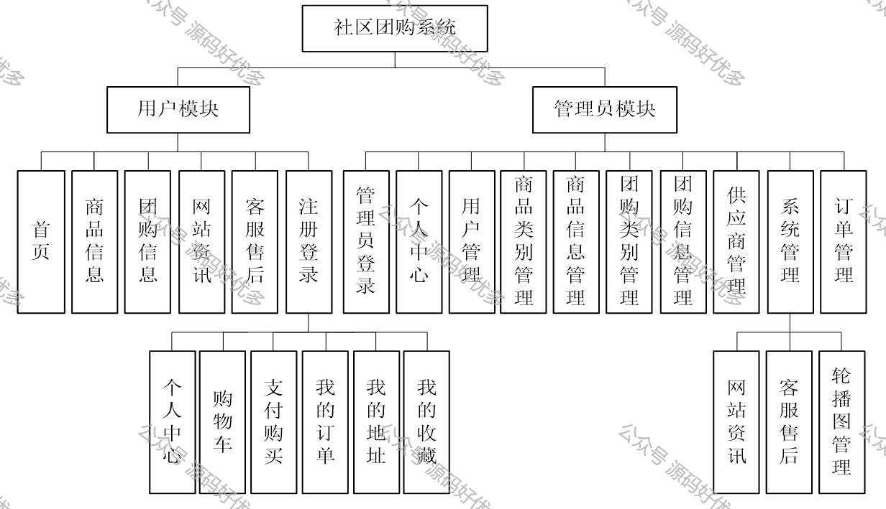
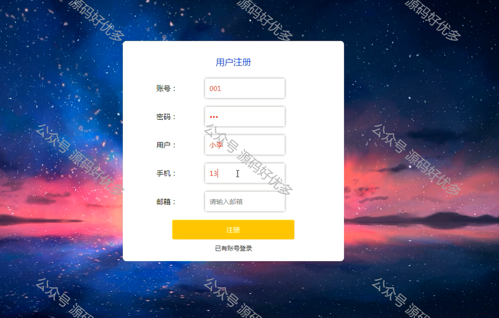
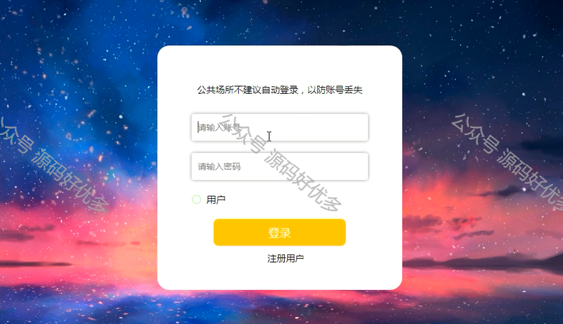
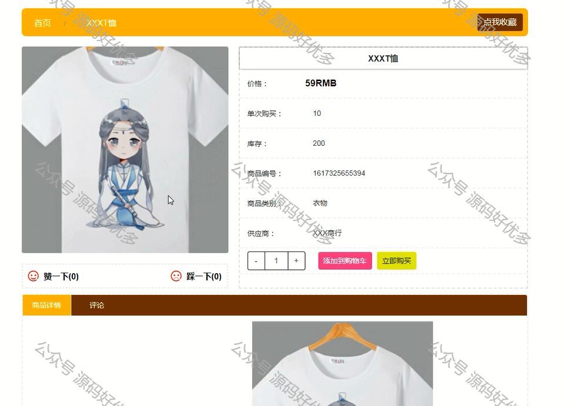
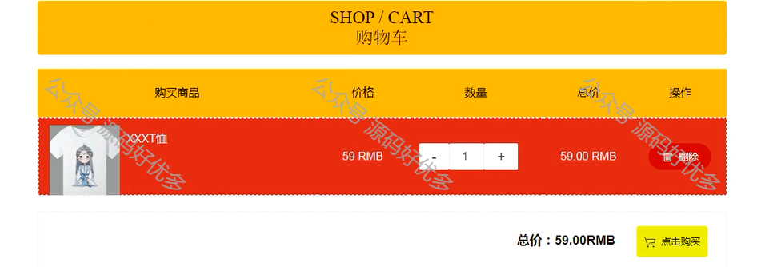
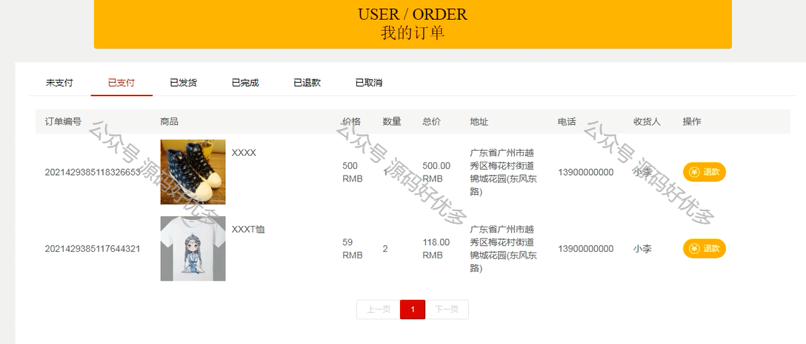
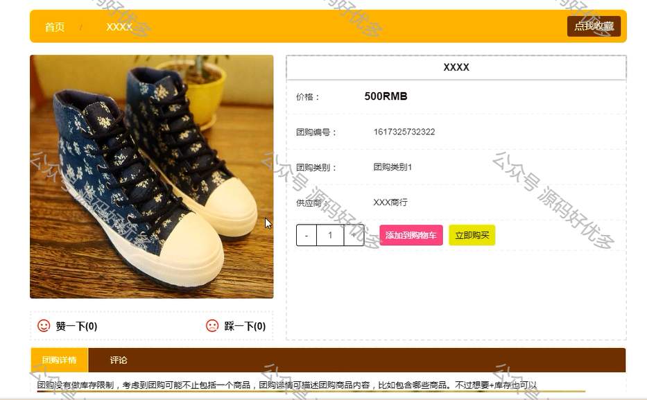
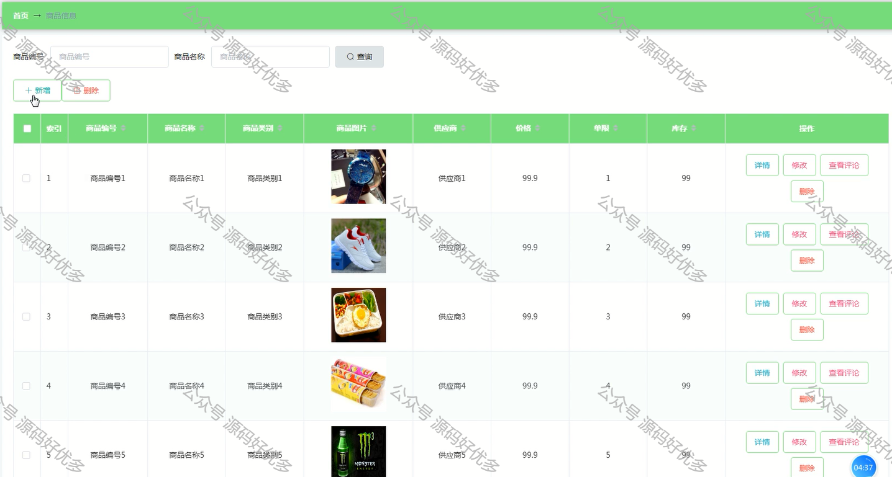
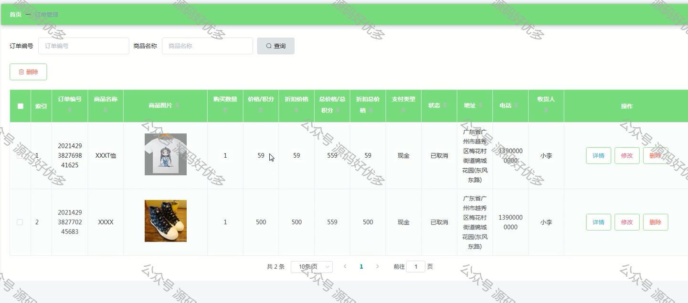

 
## 查看主页获取源码

> **作者介绍**： **✌**全网粉丝10W+本平台特邀作者、博客专家、CSDN新星计划导师、java领域优质创作者,博客之星、掘金/华为云/阿里云/InfoQ等平台优质作者、专注于毕业项目实战 **✌**

  

### 一、作品包含

源码+数据库+设计文档万字LW+PPT+全套环境和工具资源+部署教程

### 二、项目技术

前端技术：Html、Css、Js、Vue、Element-ui

数据库：MySQL

后端技术：Java、Spring Boot、MyBatis

  

### 三、运行环境

开发工具：IDEA/eclipse

数据库：MySQL8.0

数据库管理工具：Navicat10以上版本

环境配置软件： JDK1.8+Maven3.6.3

前端Nodejs：14

  

### 四、项目介绍

项目编号：springboot012

本课题是根据用户的需要以及网络的优势建立的一个社区团购系统，来满足用户团购的需求。
本社区团购系统应用Java技术，MYSQL数据库存储数据，基于Spring Boot框架开发。在网站的整个开发过程中，首先对系统进行了需求分析，设计出系统的主要功能模块，其次对网站进行总体规划和详细设计，最后对基于Spring Boot的社区团购系统进行了系统测试，包括测试概述，测试方法，测试方案等，并对测试结果进行了分析和总结，进而得出系统的不足及需要改进的地方，为以后的系统维护和扩展提供了方便。
本系统布局合理、色彩搭配和谐、框架结构设计清晰，具有操作简单，界面清晰，管理方便，功能完善等优势，有很高的使用价值。

### 五、运行截图

  
